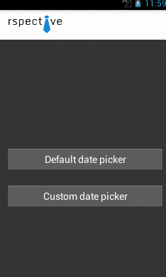

#PagerDatePicker

###Version: 1.1.0

[](https://www.apache.org/licenses/LICENSE-2.0) [](http://android-arsenal.com/details/1/1710)

###Description
PagerDatePicker is a library for Android which allows to setup horizontal (for now;)) date list picker. It is a combination of few main Android components:
* android.support.v7.widget.RecyclerView
* android.support.v4.view.ViewPager
* android.support.v4.app.FragmentStatePagerAdapter
* android.support.v7.widget.RecyclerView.Adapter

Notice that PagerDatePicker is a project under development.

####Welcome to fork and pull request.

###Features

####XML attributes:
Support date format MM-dd-yyyy

```xml
    <attr name="date_start" format="string"/>
    <attr name="date_end" format="string"/>
    <attr name="default_day_selection" format="string"/>
```

####API
* Animations
You can assign animation for selected day. This could be set for whole date item view or just for single one. To achieve this you have to load and assign animation to the adapter:

```java
dateAdapter.setCurrentViewAnimation(AnimationUtils.loadAnimation(CONTEXT, ANIM_ID_FOR_YOUR_ANIMATION));
```

To select which view has to be animated you have to override below method in your ViewHolder
```java
protected abstract View getCurrentViewToAnimate();
```

####Deafult and custom date adapter
If default date item is not enough for you don't worry, you can create your own custom date adapter where you can apply default style/view/functions to your date item.

#####Things to know:
 - You have to create your custom adapter which has to extend AbsDateAdapter
 - Your view holder has to extend AbsDateItemHolder
 - Implement required methods and add your own if you need

To check details, please see demo app.

###Screenshot


<a href="https://play.google.com/store/apps/details?id=pl.rspective.pagerdatepicker.sample">
  
</a>

###Quick Setup（Basic Usage)

#####1.Integration
######Gradle
```xml
dependencies {
    compile 'pl.rspective.pagerdatepicker:pagerdatepicker:1.1.0'
}
```

#####2.Usage (for default date adapter)
Please note, that supported date format is MM-dd-yyyy

######1. Add picker and pager to your view
```xml
<pl.rspective.pagerdatepicker.view.DateRecyclerView
    android:id="@+id/date_list"
    android:layout_width="match_parent"
    android:layout_height="100dp"
    android:background="#ff343434"/>

<android.support.v4.view.ViewPager
   android:id="@+id/pager"
   android:layout_width="match_parent"
   android:layout_height="match_parent"
   android:layout_below="@id/date_list"/>
```

######2. Add item decoration for your picker (OPTIONAL)

You can do this in two ways:
```java
dateList.addItemDecoration(new RecyclerViewInsetDecoration(this);
```
Default insets is 1dp

```java
dateList.addItemDecoration(new RecyclerViewInsetDecoration(this, R.dimen.date_card_insets));
```
Add your own insets value

######3. Create deafult adapter with date range and assign it to our picker

```java
dateList.setAdapter(new DefaultDateAdapter(start, end));
```

######4. Init pager adapter and assign it to our datepicker

```java
DatePagerFragmentAdapter fragmentAdapter = new DatePagerFragmentAdapter(getSupportFragmentManager(), dateList.getDateAdapter()) {
    @Override
    protected Fragment getFragment(int position, long date) {
        return ...
    }
};

pager.setAdapter(fragmentAdapter);
dateList.setPager(pager);
```

######5. We are almost there. Now you have to assign a listener to your picker
```java
dateList.setDatePickerListener(new DateRecyclerView.DatePickerListener() {
    @Override
    public void onDatePickerItemClick(DateItem dateItem, int position) {
        //User clicked date item from top date picker
    }

    @Override
    public void onDatePickerPageSelected(int position) {
        //User changed date using swipe (left/right)
    }

    @Override
    public void onDatePickerPageStateChanged(int state) {
        //User changed page
    }

    @Override
    public void onDatePickerPageScrolled(int position, float positionOffset, int positionOffsetPixels) {
        //User changed page
    }
});
```

If you want to change the default color, just override below colors in your colors.xml:
```xml
<color name="date_item_unselected_indicator">#ff5c5c5c</color>
<color name="date_item_selected_indicator">#ffff353b</color>

<color name="date_item_background">#ff373737</color>
<color name="date_item_month_name">#ffd5d5d5</color>
<color name="date_item_day_name">#ff9a9a9a</color>
<color name="date_item_day">#FFFFFFFF</color>
```

####If you want to see more details, go ahead and check the demo!

###Assets
Demo launcher icon was made by [jerrylow](https://www.iconfinder.com/jerrylow)

License
--------

    Copyright 2015 RSPECTIVE P RYCHLIK SPÓŁKA JAWNA

    Licensed under the Apache License, Version 2.0 (the "License");
    you may not use this file except in compliance with the License.
    You may obtain a copy of the License at

       http://www.apache.org/licenses/LICENSE-2.0

    Unless required by applicable law or agreed to in writing, software
    distributed under the License is distributed on an "AS IS" BASIS,
    WITHOUT WARRANTIES OR CONDITIONS OF ANY KIND, either express or implied.
    See the License for the specific language governing permissions and
    limitations under the License.
